# 📊 FLUXO VISUAL DO SISTEMA DE GESTÃO CONDOMINIAL

## 🎯 VISÃO GERAL DO SISTEMA

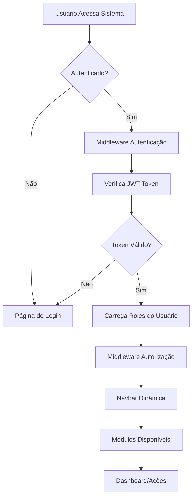

---

## 🔐 FLUXO DE AUTENTICAÇÃO E AUTORIZAÇÃO

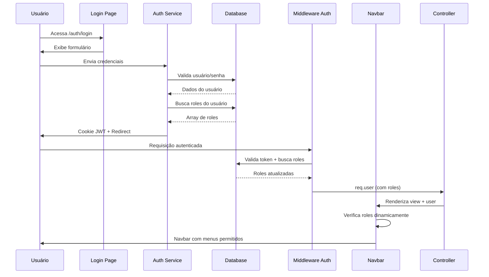

---

## 👥 FLUXO DE ROLES E PERMISSÕES

### Estrutura de Roles

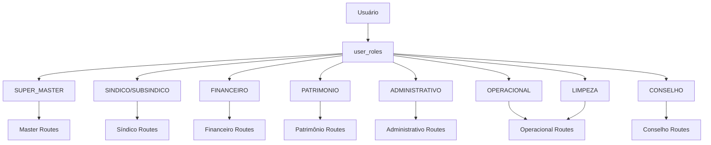

### Regra: Permissões Somam, Nunca Subtraem

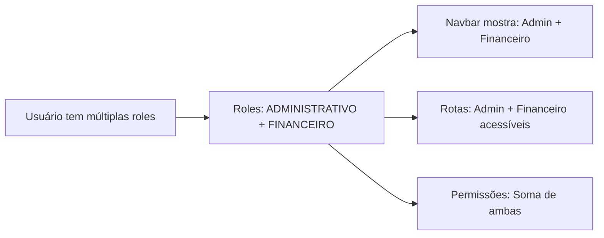

---

## 🚪 FLUXO DE NAVEGAÇÃO (NAVBAR DINÂMICA)

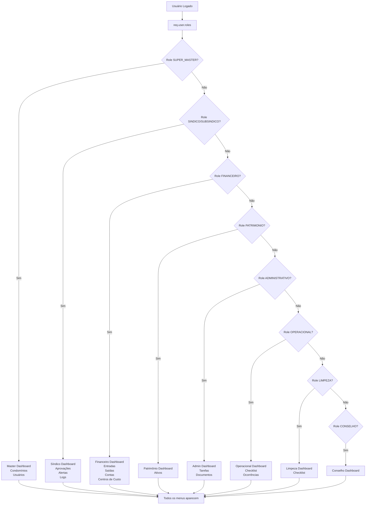

**Regra:** Se usuário tem múltiplas roles, TODOS os menus aparecem simultaneamente.

---

## 📝 FLUXO DE CRIAÇÃO/EDIÇÃO DE USUÁRIO

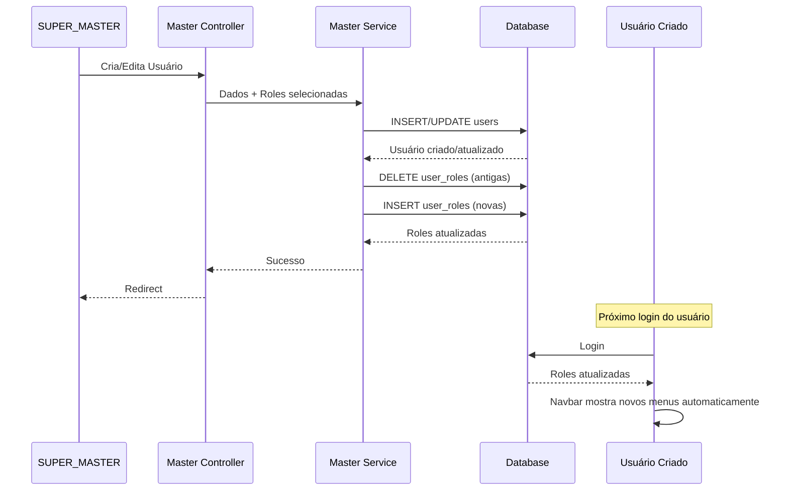

---

## 🔄 FLUXO DE APROVAÇÃO DE DESPESAS

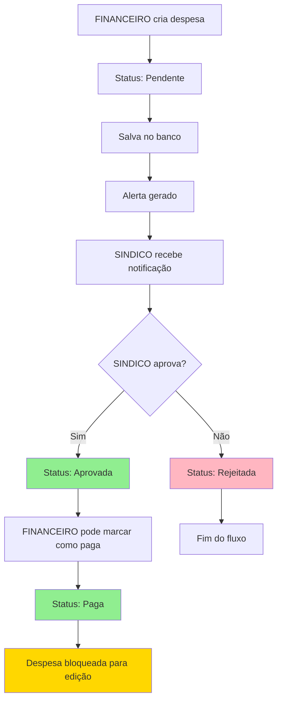

**Regras:**
- ❌ FINANCEIRO NÃO pode aprovar
- ✅ Apenas SINDICO/SUBSINDICO pode aprovar
- 🔒 Despesa aprovada/paga NÃO pode ser editada

---

## 🏢 FLUXO POR MÓDULO

### SUPER_MASTER

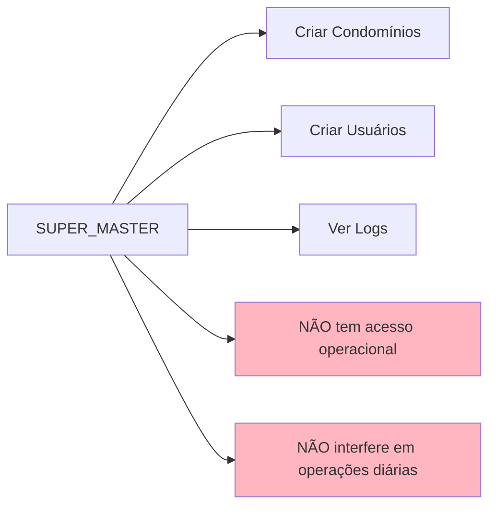

### SINDICO / SUBSINDICO

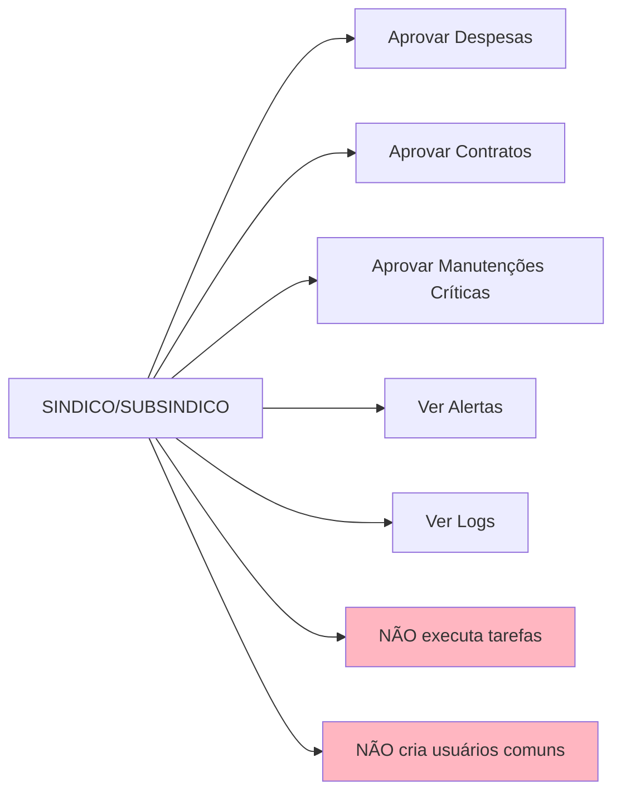

### FINANCEIRO

```mermaid
graph LR
    A[FINANCEIRO] --> B[Criar Despesas]
    A --> C[Criar Receitas]
    A --> D[Gerenciar Contas]
    A --> E[Gerenciar Centros de Custo]
    A --> F[NÃO aprova valores altos]
    A --> G[NÃO executa tarefas]
    
    B --> H[Status: Pendente]
        G[LIMPEZA<br/>Limpeza]
        H[CONSELHO<br/>Leitura]
    end
    
    A -->|Cria| B
    A -->|Cria| C
    A -->|Cria| D
    A -->|Cria| E
    A -->|Cria| F
    A -->|Cria| G
    A -->|Cria| H
    
    B -->|Aprova| D
    B -->|Aprova| E
    C -->|Cria tarefas para| F
    C -->|Cria tarefas para| G
    D -->|Cria despesas para| B
    E -->|Vincula manutenções| F
```

---

## 🔄 FLUXO COMPLETO: ADIÇÃO DE ROLE AO USUÁRIO

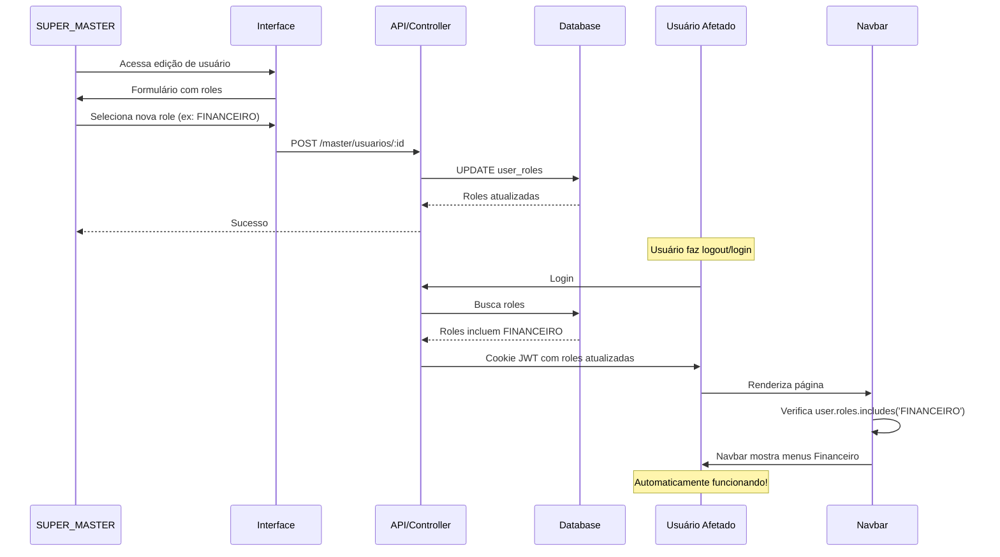

---

## 📋 RESUMO DAS REGRAS DO SISTEMA

### ✅ Regras Fundamentais

1. **Não existe cargo fixo** → Usuário possui conjunto de permissões (roles)
2. **Permissões somam, nunca subtraem** → Múltiplas roles = soma de permissões
3. **Views não definem acesso** → Apenas refletem permissões (middleware controla)
    H --> I[SINDICO aprova]
    
    style F fill:#FFB6C1
    style G fill:#FFB6C1
```

### ADMINISTRATIVO

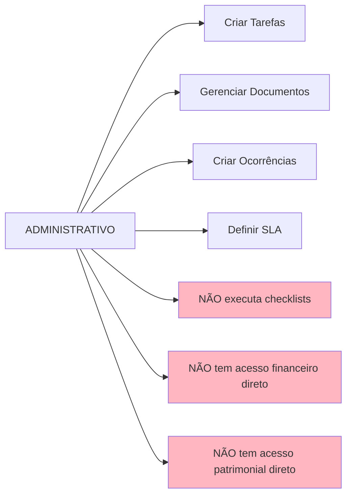

### OPERACIONAL

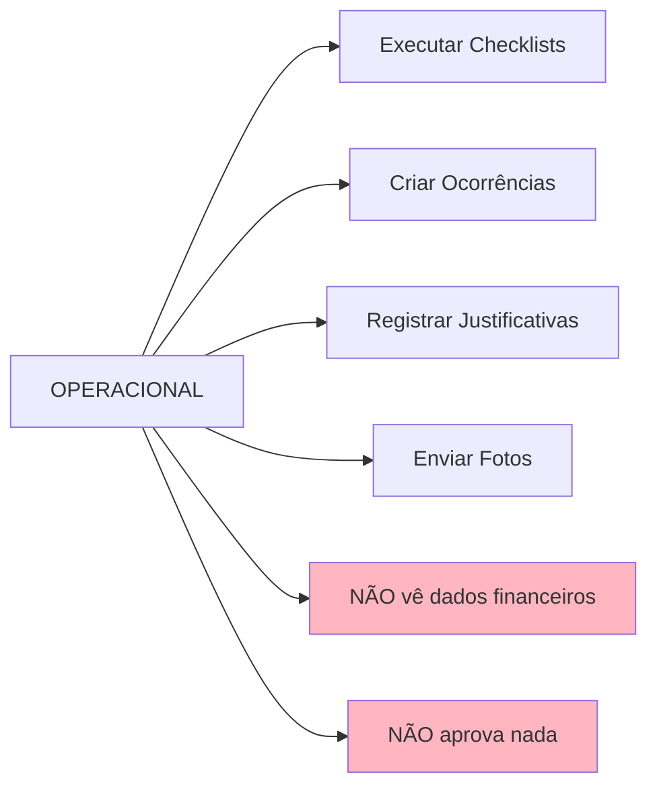

### LIMPEZA

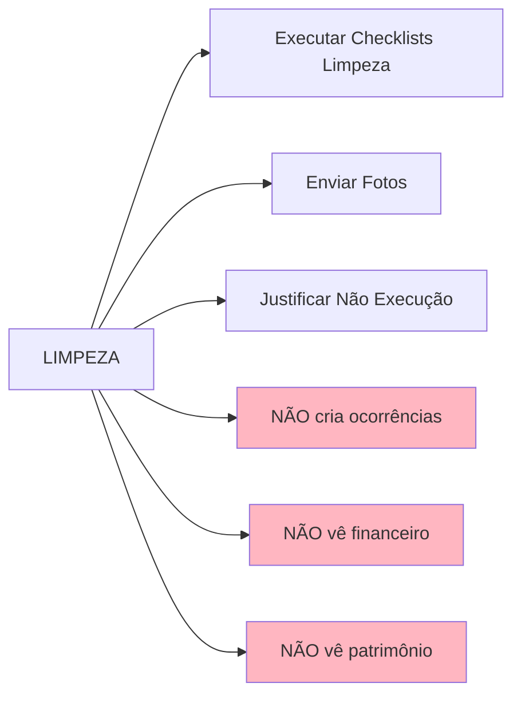

### PATRIMONIO

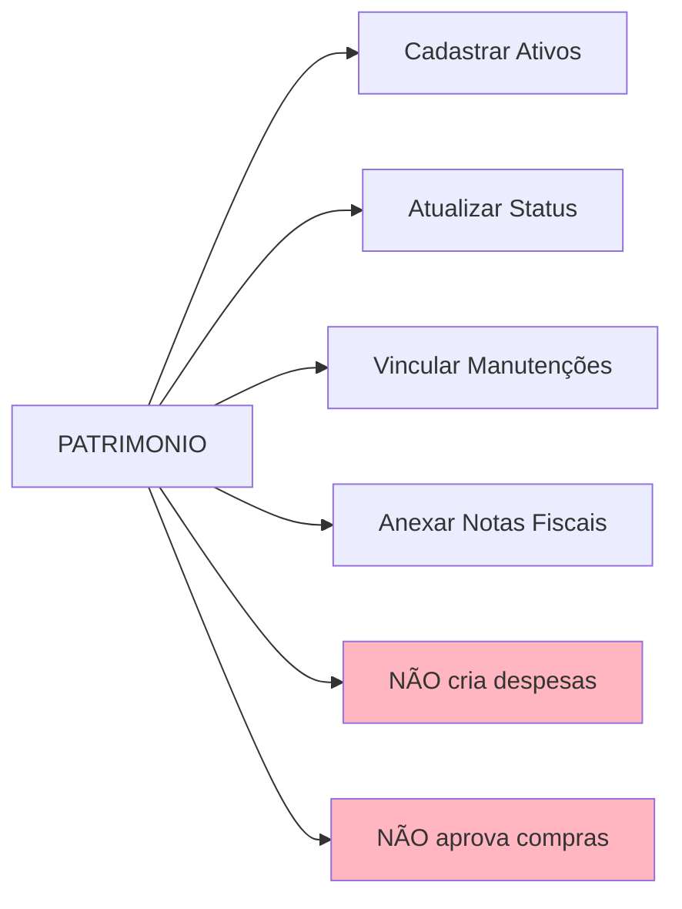

### CONSELHO

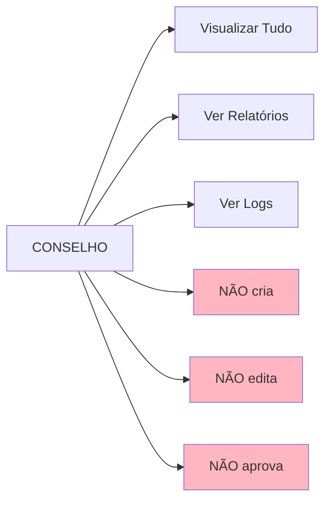

---

## 🔒 FLUXO DE MIDDLEWARE DE AUTORIZAÇÃO

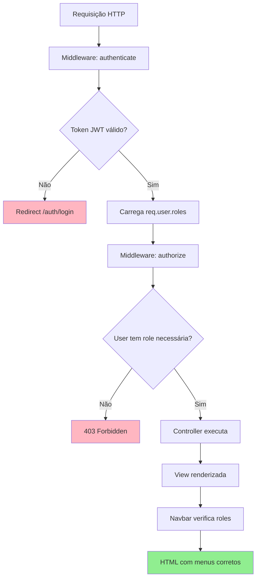

---

## 🎨 FLUXO DE RENDERIZAÇÃO DA NAVBAR

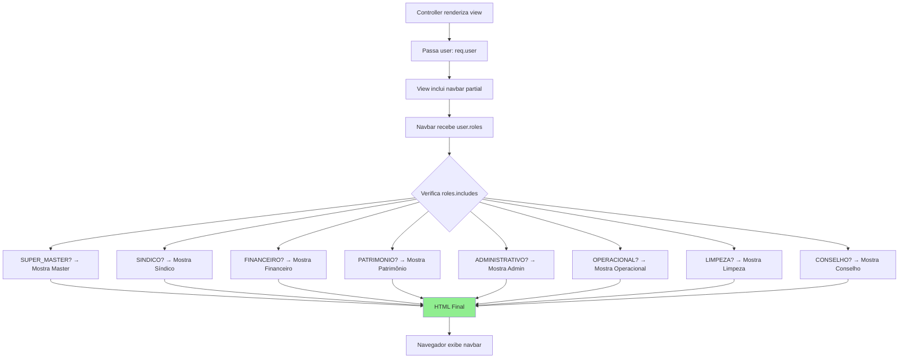

**Regra:** Se usuário tem múltiplas roles, TODOS os blocos correspondentes são renderizados.

---

## 📊 DIAGRAMA DE HIERARQUIA DE PERMISSÕES

```mermaid
graph TB
    subgraph "Níveis de Acesso"
        A[SUPER_MASTER<br/>Sistema]
        B[SINDICO/SUBSINDICO<br/>Aprovações]
        C[ADMINISTRATIVO<br/>Organização]
        D[FINANCEIRO<br/>Financeiro]
        E[PATRIMONIO<br/>Patrimonial]
        F[OPERACIONAL<br/>Execução]
4. **Quem executa não aprova** → Separação de responsabilidades
5. **Quem aprova não executa** → Separação de responsabilidades
6. **Tudo é auditável** → Logs de todas as ações
7. **Navbar dinâmica** → Aparece automaticamente conforme roles

### 🔒 Restrições Principais

- SUPER_MASTER: Não interfere em operações diárias
- FINANCEIRO: Cria despesas, mas SINDICO aprova
- ADMINISTRATIVO: Não executa, não tem acesso financeiro/patrimonial direto
- OPERACIONAL: Não vê financeiro, não aprova
- LIMPEZA: Não cria ocorrências, não vê financeiro/patrimônio
- PATRIMONIO: Não cria despesas, não aprova compras
- CONSELHO: Apenas leitura

---

## 🎯 CONCLUSÃO

O sistema funciona de forma **dinâmica e automática**:

1. ✅ Roles são verificadas em tempo real (a cada requisição)
2. ✅ Navbar se adapta automaticamente às roles do usuário
3. ✅ Rotas são protegidas por middleware
4. ✅ Permissões são cumulativas (múltiplas roles)
5. ✅ Tudo é auditado (logs)

**Quando uma role é adicionada ao usuário:**
- ✅ Rotas ficam acessíveis automaticamente
- ✅ Navbar mostra os menus automaticamente
- ✅ Não precisa alterar código
